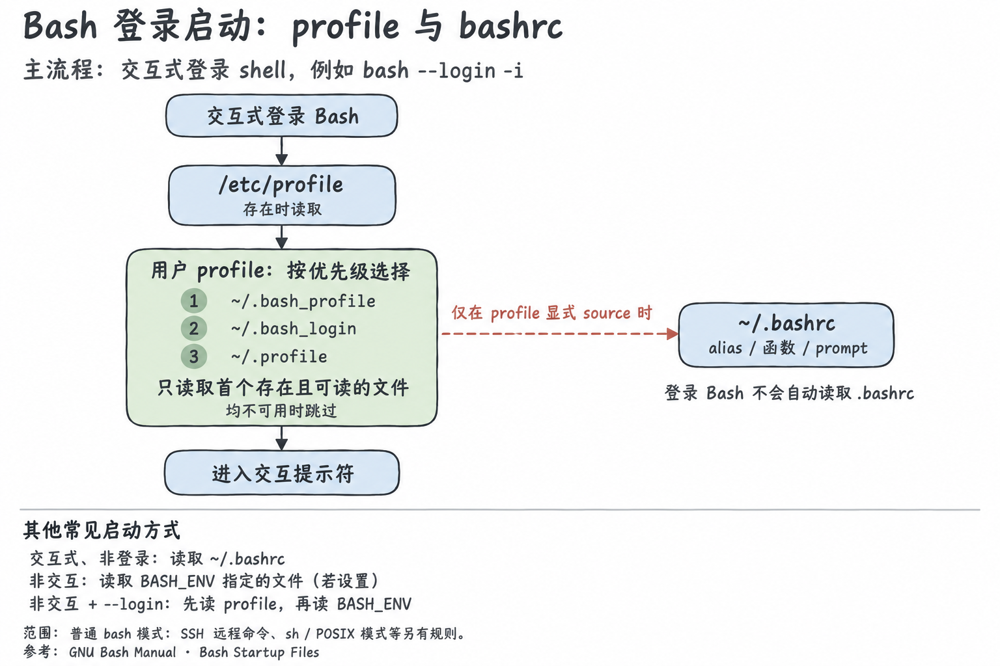

# Shell Profile 与 Bash 启动文件

**Profile 用于登录 shell 的初始化；`.bashrc` 通常承载交互配置。** 登录 Bash 不会自动读取 `.bashrc`，需要用户 profile 显式加载它。

本文以正常模式、以 `bash` 名称启动的 Bash 为例。判断当前 shell 模式的方法见 [Bash 运行模式与启动排查](bash.md)。其他 shell、`sh` / POSIX 模式和 SSH 远程命令有各自的启动规则。



## 四种启动方式

这里的“用户 profile”指下节列出的三个文件中，**首个存在且可读的文件**。

| 模式                | 显式启动示例             | 常规自动加载顺序                           |
|---------------------|--------------------------|--------------------------------------------|
| 交互式、login       | `bash --login -i`        | `/etc/profile` → 用户 profile              |
| 交互式、non-login   | `bash -i`                | `~/.bashrc`                                |
| 非交互式、login     | `bash --login script.sh` | `/etc/profile` → 用户 profile → `BASH_ENV` |
| 非交互式、non-login | `bash script.sh`         | `BASH_ENV`                                 |

不存在的启动文件会跳过；文件存在但不可读时可能报告错误。`BASH_ENV` 仅在已设置时处理，其值经展开后作为待执行文件名，Bash 不通过 `PATH` 搜索该文件。

非交互式 `--login` 的两条规则会叠加：先处理 login profile，再处理 `BASH_ENV`。Profile 内显式执行的 `source` / `.` 还可能加载其他文件。

## 用户 profile 的选择顺序

Bash 先处理系统级 `/etc/profile`，然后依次查找：

1. `~/.bash_profile`
2. `~/.bash_login`
3. `~/.profile`

**最多读取其中一个**，不是依次执行全部文件。例如，已经有可读的 `.bash_profile` 时，即使它是空文件，Bash 也不会继续自动读取 `.profile`。若要同时使用，需要显式加载。

- `/etc/profile`：系统级登录初始化。
- `~/.profile`：通常采用 POSIX sh 兼容语法，便于被使用该文件的不同 shell 共享；是否读取它仍由具体 shell 或会话决定。
- `~/.bash_profile`：Bash 专用登录入口，可组织 `.profile` 和 `.bashrc` 的加载。
- `~/.bash_login`：Bash 的另一个备选入口，优先级在 `.bash_profile` 之后、`.profile` 之前。

## 推荐的配置分工

将可共享的环境设置放入 `.profile`，由 `.bash_profile` 显式加载；交互配置放入 `.bashrc`。下面是一种组织方式，不是 Bash 自动建立的调用关系。

### `~/.profile`：环境变量

```sh
export EDITOR=vim

# 避免反复加载时重复追加 PATH。
case ":$PATH:" in
  *":$HOME/.local/bin:"*) ;;
  *) PATH="$HOME/.local/bin:$PATH" ;;
esac
export PATH
```

已导出的环境变量会传给子进程，但 profile 并不保证“每次系统登录只执行一次”；再次启动 login shell 也可能重新加载。环境设置应能承受重复执行。

### `~/.bash_profile`：衔接共享配置与交互配置

```bash
if [ -r "$HOME/.profile" ]; then
  . "$HOME/.profile"
fi

case $- in
  *i*)
    if [ -r "$HOME/.bashrc" ]; then
      . "$HOME/.bashrc"
    fi
    ;;
esac
```

这样，login shell 会加载共享环境；只有交互式 login shell 才会额外加载 `.bashrc`。交互式 non-login Bash 则按自身规则直接读取 `.bashrc`。

若现有 `.profile` 已加载 `.bashrc`，将这次调用统一放在一处，避免重复执行。

`.bashrc` 的交互判断和配置示例见 [Bash 文档](bash.md#bashrc-中的交互配置)。不要让 `.bashrc` 再反向加载 `.bash_profile`，以免形成循环或重复初始化。

## 系统与启动方式的差异

- **系统脚本**：`/etc/profile.d/*.sh` 常由 `/etc/profile` 加载；它不是 Bash 单独扫描的固定目录。
- **系统级 bashrc**：`/etc/bash.bashrc`、`/etc/bashrc` 的执行方式取决于发行版构建和脚本调用关系，不能当作所有 Bash 都具备的自动加载步骤。
- **终端与会话**：终端、SSH 和 tmux 可以启动不同类型的 shell；也不能假定所有桌面会话都读取 `.profile`。环境变量还可能来自父进程。
- **SSH 远程命令**：Bash 判断自己由远程 shell daemon 以非交互方式启动时，可能读取 `.bashrc`。因此不能把 `ssh host command` 一概视为“只读 `BASH_ENV`”。
- **启动选项**：`--noprofile` 跳过 login profile；`--norc` 跳过 `.bashrc`；`--rcfile file` 为相应启动路径指定替代的 rc 文件。
- **其他模式**：以 `sh` 名称启动、POSIX 模式，以及真实与有效 UID/GID 不一致的启动场景，遵循另外的规则，详见手册。

## 参考

- [GNU Bash Manual — Bash Startup Files](https://www.gnu.org/software/bash/manual/html_node/Bash-Startup-Files.html)
- [GNU Bash Manual — Invoking Bash](https://www.gnu.org/software/bash/manual/html_node/Invoking-Bash.html)
