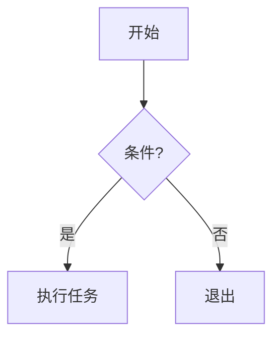
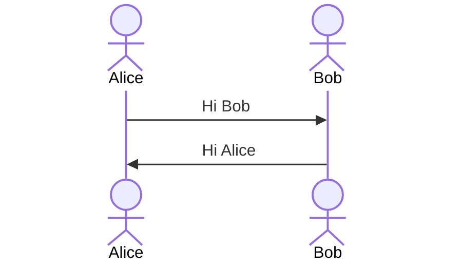

```css
.header {
  display: flex;
  justify-content: space-between;
}
```


```mermaid live title="conditional"
graph TD
  A[开始] --> B{条件?}
  B -- 是 --> C[执行任务]
  B -- 否 --> D[退出]
```


```mermaid live title="sequence"
sequenceDiagram
    actor Alice
    actor Bob
    Alice->>Bob: Hi Bob
    Bob->>Alice: Hi Alice
```
