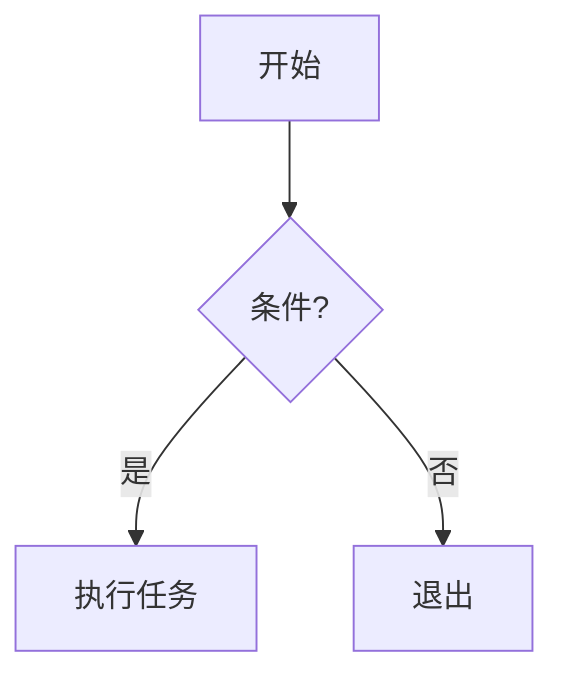
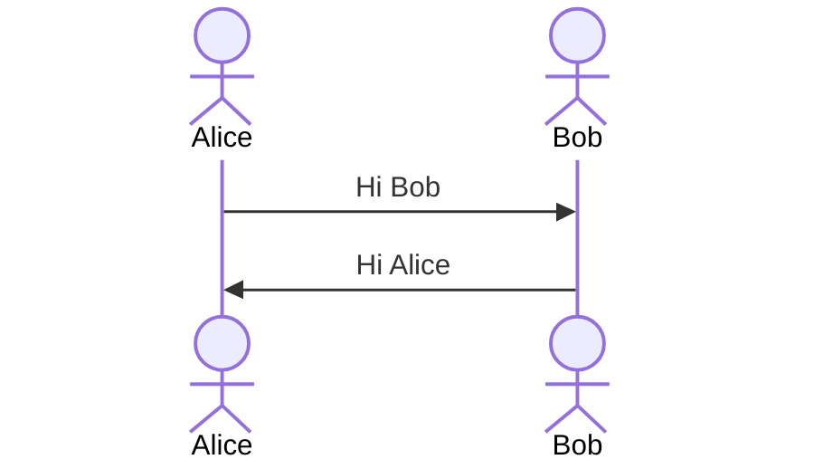

## 数学公式示例

```math embed
x^2+y^2=z^2
```

## mermaid 示例1


```mermaid embed title="conditional"
graph TD
  A[开始] --> B{条件?}
  B -- 是 --> C[执行任务]
  B -- 否 --> D[退出]
```

## mermaid 示例2


```mermaid embed title="sequence"
sequenceDiagram
  actor Alice
  actor Bob
  Alice->>Bob: Hi Bob
  Bob->>Alice: Hi Alice
```
