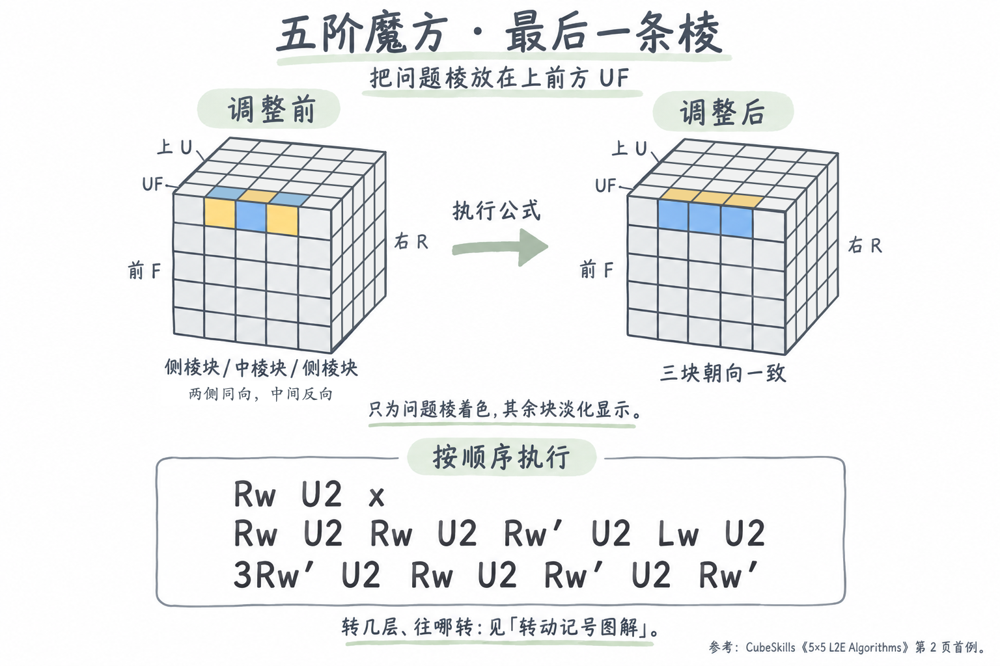
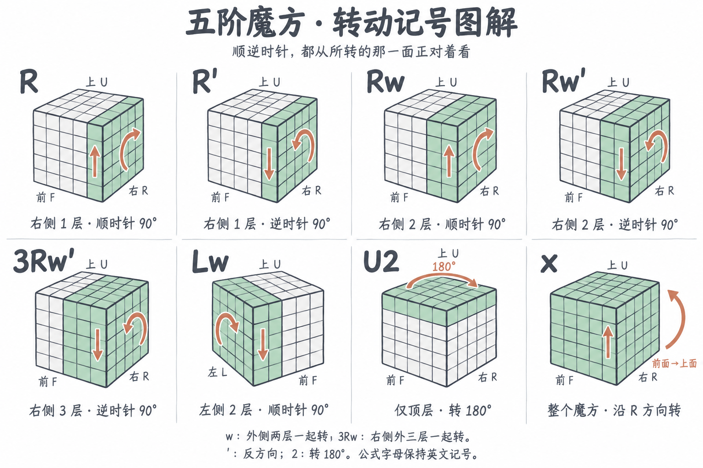

# 五阶魔方：最后一条棱配对（Last-edge parity）

适用于六个中心已还原、11 条棱已配好，只剩最后一条棱：两侧的侧棱块（wing）朝向一致，中间的中棱块（midge）与它们相反。



## 识别状态与持握

这条棱的三个块都有**相同的两种颜色**，但**两侧棱块朝向一致，中棱块朝向相反**。这是最后一条棱配对时的特殊情况，通常称为 **Last-edge parity**。

把问题棱放在 **UF（上前棱）**，即上面（U）与前面（F）的交界处。从左到右观察三个块：

```text
              调整前          调整后
上面（U）：   B  Y  B         Y  Y  Y
前面（F）：   Y  B  Y         B  B  B
```

`B` 表示蓝色，`Y` 表示黄色；任意一对棱块颜色都适用。以中棱块为基准：公式会交换两侧的侧棱块，让它们的贴纸颜色与中棱块对齐。

## 换棱公式

按顺序连续执行下面三行，换行时不要把魔方转回初始持握方向：

```text
Rw U2 x
Rw U2 Rw U2 Rw' U2 Lw U2
3Rw' U2 Rw U2 Rw' U2 Rw'
```

## 转动记号图解



- **`R` / `R'`**：正对右面看，只转右侧最外面一层，分别为顺时针 / 逆时针 90°。它们也说明了下面宽层转动的基本方向。
- **`Rw` / `Lw`**：正对所转的那一面看，右侧 / 左侧最外面的**两层一起**顺时针转 90°。
- **`3Rw`**：右侧最外面的**三层一起**转，包括中间层。
- **`U2`**：只转最外面的顶层，转 180°。
- **`'`**：反方向转。例如 `Rw'` 表示右侧外两层一起逆时针转。
- **`x`**：把整个魔方沿 `R` 的方向转动，让当前的前面变成上面。后续记号以转动后的持握方向为准。

特别注意最后一行的 **`3Rw'`**：它转三层，其他 `Rw`、`Rw'` 都转两层。这些记号表示多层一起转，不是只转某一片内层。

## 执行结果

最后一条棱配好，六个中心保持同色，其余 11 条棱保持配对。之后可以把魔方当作三阶继续还原。这是配棱阶段的公式，可能打乱已经完成的三阶阶段块位。

如果三个块的颜色组合不同，或者还有多条棱未配好，就还不属于这里描述的状态。

## 参考

- [CubeSkills — 5x5 L2E Algorithms](https://www.cubeskills.com/uploads/pdf/tutorials/last-2-edges-algorithms-5x5.pdf)，第 2 页第一个 parity 案例。本文把原公式中的 `U2'` 统一写为 `U2`，两者都是相同的 180° 转动。
