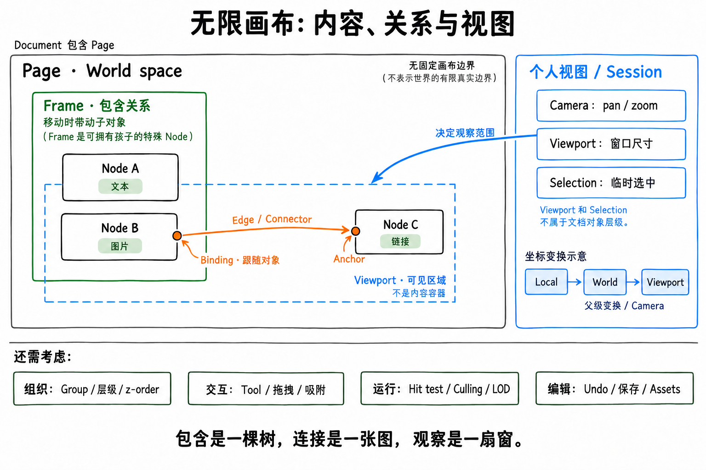

# 无限画布应用：白板与知识整理的概念设计

**TL;DR**：`frame / node / edge / viewport / selection` 都有用，但不处于同一层。建议从 **Document / Page、Node、Frame / Group、Edge / Binding、Camera / Viewport、Selection** 建立概念模型，再补充坐标变换、交互状态、编辑事务和渲染。父子层级是一棵树，连接关系是一张图，viewport 是观察窗口，selection 是当前用户的操作目标集合。

本文是面向**自由摆放内容的白板 / 知识整理应用**的初步设计讨论，不是既有实现说明。默认二维画布、单用户编辑优先；多人协作与大规模性能方案尚未选型。“推荐”表示当前设计取舍，不代表所有画布产品的统一定义。



图中绿色表示包含关系，橙色表示连接，蓝色表示个人视图与交互状态。蓝色虚线框是 viewport 映射到世界空间后的可见区域；框外对象仍然存在，这里为说明关系一并画出。

延伸讨论：[Presentation 与动画设计总览](presentation.md)，分为[讲述模型](presentation/model.md)、[动画机制](presentation/animation.md)、[播放与状态](presentation/playback.md)。

## 1. 内容中有哪些对象

### Document / Page：保存边界与空间边界

- **Document**：可保存、打开、分享的文档，拥有页面、资源引用与 schema version。它是文档持久化的逻辑边界，存储可以进一步分块。
- **Page / Board**：一片独立的二维世界，拥有自己的对象与坐标系。第一版可以只有一个 page，但概念上应与 document 区分。
- **Scene**：当前 page 的空间对象与层级组织；不必再设计成一种用户可见对象。

“无限”通常表示没有固定画布边界，并支持持续平移和缩放；它不要求分配一张无限尺寸的 bitmap。坐标精度、zoom 范围、对象数量仍需有工程约束。

### Node：有身份、内容和空间位置的对象

本文使用 **Node** 泛指 scene 中的空间对象，也可以命名为 `Shape` 或 `CanvasObject`。普通 node 可以是便笺、文本、图片、笔迹、链接卡片或 embed；不要把它预先限定为流程图中的计算节点。

共同需要考虑：稳定 ID、类型、父对象、局部变换、绘制顺序、内容 / 样式，以及 locked / hidden 等属性。尺寸与几何由类型决定：文本、笔迹和矩形不必共享同一套固定宽高语义。

对于知识整理，还要区分：

- **Content / Entity**：笔记正文、链接目标或媒体资源的身份。
- **Placement / Node**：这份内容在某个 page 上的位置、大小和展示方式。

推荐第一版让 node 持有简单文本和内容引用；图片等二进制内容通过 asset 引用。若需要“同一篇笔记出现两次，编辑正文后两处同步”，再显式引入共享 entity 与多个 placement，避免复制出两个独立正文。删除 placement 与删除 entity 届时必须是两个动作。

### Frame：有明确边界的容器 node

Frame 用于组织一个空间区域，例如“阅读资料”“待验证观点”或一张导出的画板。**推荐让 Frame 成为一种特殊 Node**，复用选择、变换、层级和绘制顺序。

应明确的语义包括：

- 子对象是否使用 frame 的局部坐标；推荐是，移动 frame 会带动后代。
- 是否裁剪越界内容；推荐白板第一版默认不裁剪，保留可配置能力。
- 调整 frame 尺寸是否缩放孩子；推荐只改边界，不自动缩放或重排孩子。
- 拖入、拖出时是否改变父对象；推荐第一版通过显式“移入 / 移出 frame”完成，并保持世界位置不变，后续再增加拖放反馈与自动归属。
- Frame 移动或扩张时是否吸收原本不属于它的对象；推荐不自动吸收。

这些是本应用的候选行为。例如 tldraw 的 frame 默认裁剪孩子，说明裁剪并不是所有产品必须采用同一默认值的概念公理。[1]

**视觉上位于 frame 内部，不足以证明 `parentId` 属于它。** 几何重叠与包含关系需要独立处理。

### Group 与 Selection：组织对象与临时操作

- **Group**：持久化的组合关系，通常以子对象包围盒确定边界，用于一起移动或变换。第一版可不支持 group，保留扩展空间。
- **Selection**：当前用户选中了哪些对象，是临时编辑状态；多选不应自动创建 group。
- **Frame**：自身有明确边界，允许空 frame，适合作为命名区域。

推荐层级模型中，每个 node 只有一个 parent：page、frame 或 group；禁止形成父子循环。兄弟节点的绘制顺序与父子包含关系分开管理。整体 z-order 还取决于祖先顺序，不能仅用一个全局数字理解嵌套对象。

### Edge / Connector、Endpoint、Binding：连接及其附着规则

**Edge** 表达“对象之间存在一条连接”；**Connector** 强调这条连接在画布上的可见图形。对于白板，推荐使用可选择、可编辑标签和样式的 connector，并将端点附着关系单独表达。

- **Endpoint**：线段端点，可是自由的世界坐标，也可以绑定到 node。
- **Binding**：端点与对象之间的持久化关联，使 node 移动后连接继续附着。[2]
- **Anchor**：绑定在对象上的位置或求解规则，例如边界上的比例位置、朝向另一端的边界交点。
- **Port**：具有稳定身份的显式连接点；对白板通常可选，工作流才更需要输入 / 输出类型和连接校验。
- **Routing**：根据端点和控制点计算线的路径；直线、折线、曲线与避障属于不同复杂度。

实现上可以让 connector 也是一种 scene node；这不改变“连接关系不等于父子关系”。为便于第一版跨 frame 连线，推荐 connector 先位于 page 层，绑定指向任意可连接 node。

推荐允许无方向、有方向和带标签的连接；从直线或简单曲线开始。删除被连接 node 时，可以删除 connector，也可以解除绑定并保留最后的世界端点；**白板第一版推荐后者，并纳入同一个 undo 事务**。

知识整理中的“支持”“反驳”“引用”可以成为 edge 的标签或关系类型；正文链接、backlink 和画布连线是否互通需要单独设计。画一根箭头，不必自动创建知识库中的引用关系。

## 2. 用户如何观察和操作内容

### Camera / Viewport：观察位置与可见窗口

- **Camera**：平移与缩放参数；推荐第一版只支持 pan / zoom，不支持 camera rotation。
- **Viewport**：画布 UI 在屏幕上占据的矩形及其尺寸。结合 camera，可以计算当前可见的世界区域。

Viewport 不拥有 node，也不是 frame。一个 document 可以同时被两个窗口以不同 zoom 查看；平移 camera 不应修改所有 node 的坐标。

推荐把当前 page、camera、selection、hover、active tool、编辑焦点归入个人 **View / Session state**。它们可以按用户保存，但应与共享 document 内容分开。命名视图或演示路径则可以作为明确的 document 功能另行保存。

### Selection：选中集合与操作目标

**Selection 的核心是对象 ID 集合，不是一个矩形。** 它可以包含普通 node、frame、group 和 connector；选中包围盒、轮廓与操作把手由这个集合和对象几何计算得到。推荐保存在当前用户的 session 中，不把 `isSelected` 写进共享 node 数据。

需要分别考虑：

- **Selected IDs / Primary selection**：哪些对象被选中；必要时再指定主选对象，例如作为对齐基准。集合本身不应隐含排列顺序，第一版也不一定需要主选对象。
- **Selection operation**：替换、追加、移除和切换选中状态。点击、Shift 点击、框选或套索是触发方式，不同手势可以执行同一种操作。
- **Marquee / Lasso**：框选矩形或套索路径属于进行中的手势；手势结束后留下 selection。还需确定“完全包含”还是“相交即选中”，并分别定义图形、线条和容器的判定规则。
- **Selection scope**：当前在 page、group 还是 frame 内选择；重叠对象如何逐层选中，如何进入与退出容器。容器本体与子对象的命中优先级应明确，避免点击卡片却总选中整块 frame。
- **Effective targets**：一次操作实际影响的对象，可能与选中集合不同。例如同时选中 frame 和它的孩子后移动，应只对选中的最外层祖先施加一次平移，孩子通过父变换跟随，避免移动两次。
- **Selection lifecycle**：删除对象、切换 page 或 undo 后如何清理与恢复选择。推荐删除后去掉失效 ID，切换 page 时使用该 page 的选择状态；selection 单独变化不产生 document undo step，但编辑事务可附带操作前后的 selection 以便恢复。

**Hover、Focus、Editing target、Text selection** 也应分开：hover 是指针当前经过的对象，focus 是键盘事件的接收位置，editing target 是正在编辑的内容对象，text selection 是正文里的光标 / 文字范围。例如选中一张便笺并进入正文编辑后，Delete 应作用于文字，不能直接删除整张便笺。

### 坐标系与 Transform

至少区分以下空间；不同框架对 `screen` 的命名可能不同，应以自己的 API 契约为准。[3]

1. **Local space**：相对父对象的坐标，适用于 frame / group 的孩子。
2. **World / Page space**：当前 page 的统一坐标，适用于跨容器计算。
3. **Viewport space**：相对画布容器左上角的 CSS 像素。
4. **Client space**：浏览器事件的 `clientX / clientY`，包含画布容器在页面中的偏移。

没有旋转、倾斜或 CSS 缩放时，约定 `c` 为 viewport 左上角对应的世界坐标，`z > 0` 为 zoom，`o` 为画布内容区域在 client space 的原点：

```text
viewportPoint = (worldPoint - c) * z
worldPoint    = viewportPoint / z + c
clientPoint   = viewportPoint + o
worldPoint    = (clientPoint - o) / z + c
```

这里的公式是一种选定约定，不能直接套用到采用其他 camera 符号定义的 SDK。嵌套、旋转和缩放通常需要沿祖先链组合 affine transform；逆变换用于把指针位置映射回对象局部空间。[4]

如果 bitmap renderer 使用 `devicePixelRatio`，它影响绘制缓冲区分辨率；不要因此把 DPR 再乘进 CSS 像素到世界坐标的公式。若画布祖先有 CSS transform，应使用相应的完整逆变换。

两个适合验证坐标契约的例子：

- `c = (100, 50)`、`z = 2`、世界点 `(130, 80)`，对应 viewport 点 `(60, 60)`。
- Zoom 以鼠标为中心时，缩放前后鼠标下的世界点 `w` 不变；新的 camera 应满足 `c' = w - viewportPoint / z'`。

### Tool / Gesture / Interaction state

工具是用户当前的意图，例如 select、hand、draw、connector；手势是具体动作，例如 pointer drag、双指 pinch。需要显式管理 idle、pressing、dragging、resizing、text editing 等交互状态，避免画布拖拽与文本选字争抢输入。

推荐将当前手势的起点、拖动预览、修饰键与取消行为显式建模。例如按 Escape 取消正在进行的拖动，恢复手势开始时的位置；完成后再形成一次编辑事务。

第一版就应保留键盘操作、焦点管理与文本编辑的入口；可访问性不能仅依赖画布上的像素命中。

### Handle / Overlay：操作入口与视觉反馈

- **Handle / Gizmo**：调整尺寸、旋转、修改 connector 端点或路径控制点的操作入口。它们根据对象类型和当前工具出现，拖动 handle 会修改对应的 document 数据。
- **Overlay / Indicator**：selection 轮廓、框选区域、hover 高亮、吸附辅助线等视觉反馈。它们不需要成为普通文档 node，也不应默认出现在导出图片里。
- **Screen-space sizing**：操作把手、线条命中容差和吸附阈值通常使用 CSS 像素定义，再按当前 zoom 换算，避免 zoom out 后难以操作。

## 3. 支撑这些概念的运行机制

- **Geometry / Hit testing**：对象的几何、包围盒和精确命中规则。先用包围盒筛候选，再按类型精确检测；“点在 AABB 内”不等于命中旋转后的图形或细线。
- **Rendering / Culling**：按可见区域决定需要绘制的内容。被裁掉的对象仍保留在 document 中；视口外端点之间的 connector 也可能穿过视口，不能只按端点是否可见判断。
- **Spatial index / LOD**：对象增多后，通过空间索引减少搜索，通过细节层级控制绘制成本。索引、路径与包围盒通常是可重建的派生数据；具体结构与启用阈值应由数据规模和测量决定。
- **Transaction / History**：一次用户意图对应一个可撤销事务。例如拖动 frame、更新绑定线和调整 parent，撤销时应一起恢复。拖动预览可以高频更新，一次完整手势通常只产生一个 undo step。
- **Persistence / Assets**：稳定 ID、schema version、迁移、自动保存及资源引用。导出需要包含资源依赖，并明确导出 page、selection 还是 frame。
- **Collaboration（可后置）**：共享 document 的并发编辑与个人 presence 分开。若多人同时编辑是首发需求，应在开始时确定一致性与撤销语义；本文尚未选择 CRDT、OT 或其他方案。

渲染后端可选 DOM / SVG、Canvas 2D、WebGL 或混合方式。富文本编辑、对象规模和绘制类型会影响选择，当前不预先绑定方案。

## 4. 三条关系与三个状态边界

这几种关系必须分别表达：

- **包含**：`Page → Frame → Node`，描述父子关系与变换继承。
- **连接**：`Node A ↔ Node B`，描述 edge / binding，允许跨 frame；是否有向由该 edge 决定。
- **观察**：`Camera + Viewport → 可见世界区域`，描述当前视图，不能据此改变前两种关系。

状态也应分开：

- **Document state**：对象、内容、层级、连接、资产引用，以及已创作的 presentation / 动画定义；需要持久化与撤销。
- **Session state**：camera、selection、工具、焦点、进行中的手势，以及当前播放位置；主要服务当前用户。
- **Derived runtime state**：世界变换、包围盒、空间索引、可见集合、缓存；可从前两类重建。

例如，把卡片从 Frame A 移入 Frame B，需要修改 parent 并换算局部坐标以保持视觉位置；它与另一张卡片的连接依然存在。随后 zoom out，只改变 camera 和可见集合，不改卡片正文与 parent。

## 5. 推荐的第一版范围

1. 一个 document、一个 page，支持 pan / zoom。
2. 文本、便笺、图片和链接卡片；稳定 ID、位置、尺寸与绘制顺序。
3. 选择、多选、移动、缩放尺寸、文本编辑、删除、复制粘贴。
4. Frame：命名、包含、整体移动，默认不裁剪；显式移入 / 移出并保持世界位置。
5. Connector：自由端点、对象绑定、可选方向与标签；移动对象时保持附着。
6. Transaction、undo / redo、保存 / 加载、asset 引用和 schema version。

按真实使用场景再加入 group、自动吸附、搜索定位、minimap、多 page、共享 entity、多用户协作。搜索与正文链接如果是主要知识检索入口，可以优先于 group 和 minimap。

**Node 的内容模型**仍是一个关键产品决策：画布主要承载独立便笺，还是既有笔记的空间化视图？前者可以先把正文存在 node 上；后者更适合尽早分开 entity 与 placement。

## 6. 还有哪些容易遗漏的概念

以下作为后续讨论清单，不表示每项都需要独立 class 或进入第一版。

**交互与编辑**：

- **Snap / Guide**：对齐到网格、对象边缘、中心或等距位置；snap 是位置求解规则，guide 是对应的提示线。需要定义阈值、优先级和临时禁用方式。
- **Command / Transaction / History**：command 表达用户意图，transaction 将关联修改组成一次原子编辑，history 记录撤销与重做。例如“删除选中对象”还会处理子对象和绑定，不能只移除几个 ID。
- **Clipboard / Duplicate**：复制的是一个对象集合及其关系。粘贴时需要分配新 ID、重映射集合内部的 parent / binding，并决定指向未复制对象的绑定如何处理；跨 document 还涉及资源依赖。
- **Capabilities / Lock / Visibility**：对象是否可选择、可编辑、可连接、可删除，以及是否锁定或隐藏。不要用一个 `locked` 代替全部能力判断；例如锁定对象仍可能允许选中后查看属性。

**空间与表现**：

- **Geometry / Bounds / Hit region**：真实几何、包围盒和可点击区域是三个概念。例如一条细线的可点击范围通常比它的绘制宽度大，旋转矩形的 AABB 也包含图形外的空白。
- **Stacking order / Layer panel**：绘制先后、命中优先级与层级面板。Layer panel 可以直接展示 scene tree；只有产品确实需要独立图层时，再增加 Layer 实体。
- **Layout / Constraint**：手工位置、自动布局和约束规则分别由谁决定。例如卡片属于自动布局 frame 时，拖动可能调整排列顺序，而不是永久改变自由坐标；自由白板第一版可暂缓。
- **Style / Theme / Default style**：对象保存的样式、应用主题与新建对象的默认样式应区分。例如切换深色 UI，不应意外改写所有便笺的显式颜色。

**知识整理与文档边界**：

- **Link / Reference / Backlink / Tag**：内容之间的引用、可反查的关系与分类信息；需要明确它们属于共享 entity 还是某个 placement，并决定是否与可见 edge 互通。
- **Navigation / Search / Bookmark**：按内容或对象定位、fit selection、返回上一个观察位置、命名视图与 minimap。搜索结果需要能定位到具体 page 和 placement；minimap 是派生视图。
- **Asset / Import / Export**：媒体资源的身份、加载状态、依赖与生命周期。例如复制两张使用同一图片的卡片，不必复制两份图片；删除一张卡片时也不能立即删掉仍被另一张引用的资源。
- **Presence / Comment / Permission**：多人场景下，光标和远端 selection 是临时 presence，评论是持久化内容，权限决定允许哪些操作。评论锚定到对象还是世界坐标，会影响对象移动后的跟随行为。

推荐优先讨论 **Selection → Tool / Gesture → Command / Transaction**：先确定操作目标，再确定交互过程与撤销边界，能让后续移动、连线、复制和文本编辑共用一致的规则。

## 参考与验证边界

以下资料用于核对术语和机制，不表示本设计直接采用相同实现。文中的默认行为与 MVP 范围是设计建议；尚未通过应用原型、用户测试或性能基准验证。

1. [tldraw — Frame shape](https://tldraw.dev/sdk-features/frame-shape)：容器、局部坐标、子对象裁剪与整体变换。
2. [tldraw — Bindings](https://tldraw.dev/sdk-features/bindings)：持久化附着关系及对象变化时的关联更新。
3. [tldraw — Coordinates](https://tldraw.dev/sdk-features/coordinates)：screen、viewport、page space 的区分；另见 [Shapes](https://tldraw.dev/docs/shapes)。
4. [MDN — DOMMatrix](https://developer.mozilla.org/en-US/docs/Web/API/DOMMatrix)：浏览器中的变换矩阵表示及运算接口。
