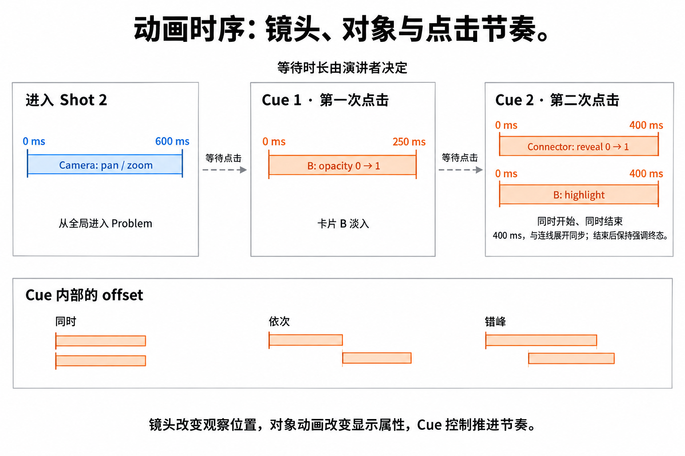

# Presentation 动画机制

[总览](../presentation.md) · [讲述模型](model.md) · [动画机制](animation.md) · [播放与状态](playback.md)

**TL;DR**：分别定义镜头变化、对象属性变化与时间编排。第一版使用预设和 cue 内的局部时间，保留明确的起止值、duration、offset 与 easing。以下是候选设计，尚未经过原型验证。



图中每段从自己的 `0 ms` 开始，点击之间的等待时长不固定。本例将 Cue 2 的连线展开与 B 强调都设为 `400 ms`，同时开始、同时结束，并保持终态；这些时长是示例参数。

## 镜头转场：Camera transition

改变 camera 的中心与 zoom，让观众从全局移动到局部。它影响当前视野内所有对象的投影，不改变 node 的世界坐标。

推荐通过镜头中心 `m` 和缩放 `z` 插值。若渲染器使用世界左上角 `c`，在有效演示区域宽高为 `W / H` 时，换算为 `c = m - (W, H) / (2z)`。Zoom 用对数空间插值是一种合理起点：

```text
u    = clamp(elapsed / duration, 0, 1)
e    = easing(u)
m(u) = (1 - e) * m0 + e * m1
z(u) = exp((1 - e) * ln(z0) + e * ln(z1))
```

约束 `z0, z1 > 0`；`duration = 0` 时直接切到终点，不做除法。第一版使用无过冲的 easing。比如 zoom 从 `1` 到 `4`，在线性 easing 的中点得到 `2`，对应比例上的中间值。

镜头目标为宽高 `w / h` 的世界矩形，屏幕两侧各留 `p` CSS 像素时，可从 `z = min((W - 2p) / w, (H - 2p) / h)` 计算 contain fit；要求尺寸为正且 padding 留有有效区域，再按支持范围限制 zoom。

固定画幅可用 letterbox 留边，避免不同显示器比例改变构图。图中目标矩形以外的内容是否显示，由演示视图的裁剪策略决定，不必修改 Frame 的文档裁剪属性。跨 page 时两个坐标空间没有连续关系，推荐直接切换或淡入淡出。

## 对象动画：Object animation

常见预设可以归约为少数属性：

- **Appear / Disappear**：离散的显示状态；透明度为零时是否还允许点击，需要另行定义。
- **Fade**：opacity。
- **Move / Scale / Rotate**：展示用 transform；需要明确坐标空间、旋转方向和 pivot。
- **Highlight / Dim**：颜色、描边或强调 overlay。
- **Draw / Reveal**：connector 或笔迹路径的可见进度；路径本身仍完整存在。

推荐第一版在父局部空间叠加展示变换，默认以对象中心为 pivot。Frame 的展示变换通过层级传递给孩子；孩子自己的动画再与它组合。移动绑定对象时，connector 的路径必须基于**本帧求值后的世界几何**重新计算，才能持续附着。

进入动画需要显式的初始状态：例如一张卡片在第一次点击前就是隐藏的，点击后淡入；不能等动画启动才临时隐藏，否则刚进入 shot 时会闪现。

## 编排：何时触发、一起还是依次

编排表达动画之间的时间关系。第一版可把一个 cue 看作并行动画组，每条 clip 有自己的 offset；顺序播放等价于后一个 offset 位于前一个结束之后，错峰播放则逐个增加 offset。

“点击时”“与上一项同时”“上一项之后”可以是作者看到的编辑选项，再转换为组内时间。第一版无需开放任意触发依赖图；若以后允许依赖图，需要拒绝循环和无法满足的依赖。

**点击驱动的 presentation 没有预先确定的整场时长**，因为演讲者停留多久未知。先使用 `(shotId, cueIndex, localTime)` 定位播放；自动播放或视频导出再补充停留时长，或记录点击的实际时间。
