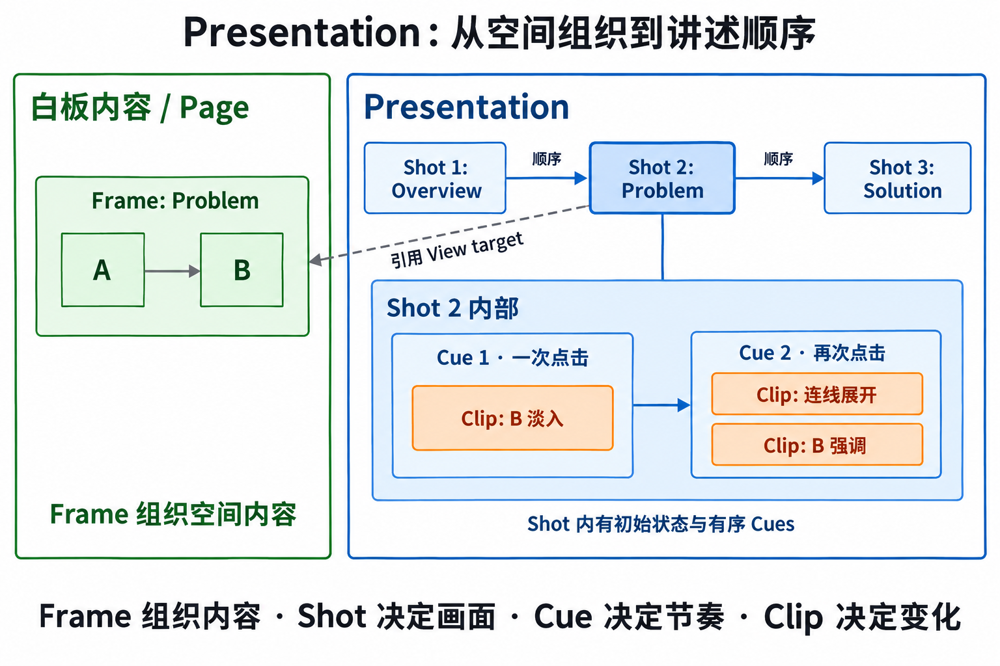

# Presentation 讲述模型

[总览](../presentation.md) · [讲述模型](model.md) · [动画机制](animation.md) · [播放与状态](playback.md)

**TL;DR**：Frame 组织空间内容，Shot 组织讲述画面，Cue 组织推进步骤，Animation clip 描述具体变化。本文的 Shot 不等同于空间对象集合 Scene。以下是应用内二维 presentation 的候选设计，尚未经过原型验证。

右侧实线箭头表示讲述顺序，左侧 A → B 表示文档中的连接，虚线箭头表示引用；下方是 Shot 2 的展开视图，框的嵌套表示包含。

## 讲述结构

- **Presentation**：有序的讲述路线，引用现有 page 和对象，保存标题、画幅比例、默认转场等设置。同一份白板可以有多条路线。
- **Shot**：一个讲述画面，包含观察目标、初始展示状态和有序 cues。可以看某个 frame，也可以看固定的世界矩形；同一个 frame 可以被不同 shots 重复引用。
- **View target**：`pageId` 加 frame 引用或固定世界矩形，以及 padding / fit 策略。它描述希望看到什么，播放时结合输出尺寸求得 camera。
- **Cue / Build**：一次推进对应的展示步骤，通常由点击触发。一个 cue 可以让多个对象同时或错峰变化；最后一个 cue 完成后，再推进才进入下一个 shot。
- **Animation clip**：作用于明确目标的一段属性动画，包含起始值、结束值、开始偏移、持续时间和 easing。目标可以是 node、connector 或 presentation camera。
- **Playback state**：当前 shot、cue、局部时间、播放 / 暂停状态、速度；属于当前播放 session。

第一版推荐以 **shot 列表 + cue 列表 + 动画预设**作为编辑界面。Track / Keyframe 可以后续加入：track 是同一目标同一属性的一条时间通道，keyframe 是该通道上的时间和值。数据层先保留明确的目标、属性和时间，避免把播放实现绑在 UI 面板上。

推荐在进入播放时，按固定的基础文档版本将 frame 目标解析为世界矩形。Shot 内的对象动画不会自动改变镜头目标；动态跟随移动对象可以作为以后单独支持的 camera 行为。

## 一个具体的讲述例子

画布上有三个 frames：Overview、Problem、Solution；Problem 中有两张卡片和一条 connector。

1. **Shot 1 / Overview**：以全局视图开场。
2. **进入 Shot 2 / Problem**：camera 用 600 ms 移动到 Problem；卡片 A 可见，卡片 B 与 connector 初始隐藏。该初始状态在进入转场开始时生效。
3. **Cue 1，第一次点击**：卡片 B 用 250 ms 淡入；它在基础文档里本来就存在。
4. **Cue 2，第二次点击**：connector 用 400 ms 从 A 向 B 展开，并同时强调 B。
5. **再次点击进入 Shot 3 / Solution**：camera 转向 Solution。它有独立的初始展示状态。

这里 `Frame` 负责内容组织，`Shot` 负责观察与讲述上下文，`Cue` 负责节奏，`clip` 负责具体运动。返回 Shot 2 的 Cue 1 终态时，应直接得到“B 可见、connector 隐藏”的确定画面。
