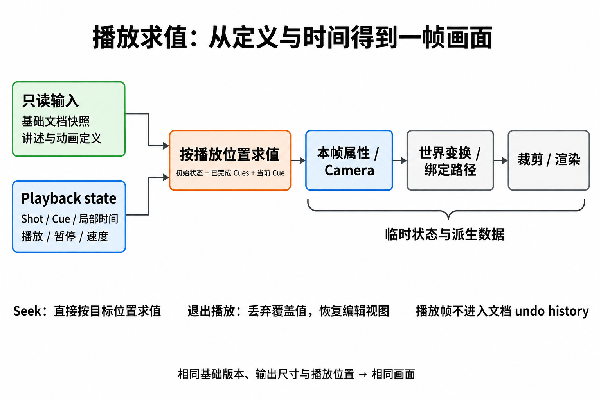

# Presentation 播放与状态

[总览](../presentation.md) · [讲述模型](model.md) · [动画机制](animation.md) · [播放与状态](playback.md)

**TL;DR**：编辑保存动画定义，播放求值临时画面；通过固定基础版本和确定的播放位置支持 seek、返回与退出。以下是候选设计，文末列出实现后的验收条件。

## 保存定义，求值画面

最重要的边界是：**编辑动画会修改文档，播放动画只产生临时的 presentation state。**

数据流从只读定义和播放位置进入求值器；本帧结果用于几何计算与渲染，不写回基础文档。

- **Authoring state**：保存 shot 顺序、view target、初始覆盖值、cues 和 clips；编辑这些定义时进入文档 undo history。
- **Playback state**：保存当前播放位置、时钟与临时覆盖值；播放帧不进入文档 undo history。
- **Derived state**：本帧的变换、包围盒、connector 路径与可见集合；从当前求值结果派生。

推荐用基础文档加 shot 初始覆盖值，按定义顺序计算已完成 cues 的终点，再求值当前 cue。它可以在进入播放时预编译成各步骤的起止状态；seek 时直接取得目标步骤的状态，无需让之前所有动画实际播放一遍。

必须提前规定的行为：

- **初值与保持**：clip 的 `from` 来自可重建的步骤起始状态或显式定义，不能读取恰巧残留在 DOM 上的值；完成后默认保持终值。临时强调可以显式定义“变亮再恢复”。
- **冲突**：第一版拒绝同一目标、同一属性在时间上重叠的多个 clips。将来若支持 additive / replace，需要明确组合规则；不能由回调执行先后来决定。
- **Shot 隔离**：每个 shot 从明确的初始状态开始，不隐式继承上个 shot 的临时对象动画结果。需要连续讲述时，应显式承接终态；camera 转场可从上个画面的最终 camera 开始。
- **文档变化**：第一版进入播放时固定一份基础文档版本。返回编辑后再更新播放内容，避免实时协作改变 clip 的起值或几何。
- **退出播放**：丢弃演示覆盖值，恢复编辑前的 camera 和 selection；演示期间默认不显示编辑用 handles，临时 laser pointer 可作为独立 overlay。

Selection 只用于**创作时选择动画目标**。保存动画时将目标解析为稳定 ID；之后换一个 selection，不应改变既有动画绑定的对象。复制对象时是否一起复制动画、删除目标时如何标记失效引用，也应有明确规则；推荐保留诊断并允许作者修复，播放时安全跳过失效目标。

## 播放控制与时钟

推荐第一版采用以下可预测的导航规则：

- **Next**：若当前 cue 正在播放，先把它完成到终态；下一次 Next 再启动下一个 cue。进入 shot 的镜头转场也适用此规则。
- **Previous**：回到当前 cue 之前的稳定状态，而非倒放整段动画；在 shot 起点时返回上一 shot 的最终展示状态。可在编辑器中另做拖动 playhead 的预览。
- **Pause / Resume**：暂停与恢复逻辑播放时间；不靠累加渲染帧数计时。
- **Jump**：明确跳到目标 shot 的初始状态或指定 cue 的终态。跳转结果只由目标位置与定义决定，与来路无关。

浏览器中可用 `requestAnimationFrame` 驱动刷新，但它只负责“何时绘制”，动画进度应由时间戳计算；不同屏幕刷新率不能改变动画速度。[1] 后台标签页可能暂停 rAF，推荐默认暂停演示逻辑时钟，恢复后从原处继续，避免意外跳过讲述步骤。

Web Animations API 可以承载部分 DOM 动画，其 `currentTime` 支持读写和 seek；它可以是渲染适配层，但画布的 camera、connector 与其他后端仍应服从同一个逻辑时钟。[2]

尊重 `prefers-reduced-motion`，并提供演示内选项。[3] 减少动态效果时可以把镜头漫游和大幅位移动画改为立即到达终态，同时保留 cue 的点击顺序及内容揭示语义。

## 验证标准

实现后应验证这些行为；目前仅是验收条件，尚未运行原型测试：

- 在相同基础文档版本和输出尺寸下，从开头播放到某个 cue，和直接 seek 到同一位置，得到相同的对象属性与 camera。
- 退出播放后，基础 node 坐标、样式、hidden 状态与 undo history 不因播放发生变化。
- Frame 和孩子同时做动画时，孩子的世界变换正确；绑定线持续贴合对象。
- 动画中连续按 Next / Previous、暂停后恢复，仍符合明确定义的导航规则。
- 更换窗口尺寸、使用不同刷新率、后台恢复与减少动态效果时，内容顺序保持一致。

## 参考与验证边界

以下资料支撑浏览器时间与可访问性机制；Shot / Cue 分层、导航策略和默认行为是本文的设计建议。

1. [MDN — requestAnimationFrame](https://developer.mozilla.org/en-US/docs/Web/API/Window/requestAnimationFrame)：刷新回调、时间戳及后台暂停行为。
2. [MDN — Animation.currentTime](https://developer.mozilla.org/en-US/docs/Web/API/Animation/currentTime)：获取与设置动画播放时间。
3. [MDN — prefers-reduced-motion](https://developer.mozilla.org/en-US/docs/Web/CSS/@media/prefers-reduced-motion)：用户减少动态效果的偏好。
